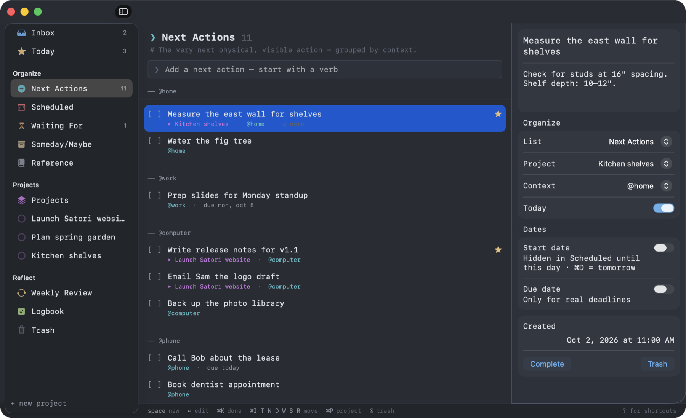

<p align="center">
  
</p>

<h1 align="center">Satori</h1>

<p align="center">
  A small, keyboard-first <b>Getting Things Done</b> app for macOS, with a terminal soul.
  <br>
  <a href="https://satorigtd.app/"><b>satorigtd.app</b></a>
</p>

<p align="center">
  <a href="https://github.com/emcee5000/satori/actions/workflows/build.yml"></a>
  
  
  <a href="LICENSE"></a>
</p>

---

<p align="center">
  
</p>

Satori is a native task manager built around David Allen's *Getting Things Done* (GTD), in the spirit of
[Things](https://culturedcode.com/things/), but smaller, free, and designed to run entirely from the keyboard.
It looks like a terminal (think [Ghostty](https://ghostty.org)): monospaced type, `[ ]` checkboxes, a `❯` prompt
for capturing, and a status line that always shows which keys work right now.

- **Native & tiny:** pure SwiftUI, no dependencies, under 10 MB.
- **Private:** no accounts, no tracking. Your tasks live in one readable JSON file, synced only if you choose.
- **On your phone too:** a tiny web app for iPhone that syncs through a private GitHub repo you own.
- **Keyboard-first:** every action has a shortcut, and the app teaches them as you go.
- **Opinionated about GTD:** inbox processing, contexts, projects that need a next action, and a weekly review.

## Contents

- [Install](#install)
- [Build from source](#build-from-source)
- [How Satori maps to GTD](#how-satori-maps-to-gtd)
- [Using Satori](#using-satori)
- [Keyboard reference](#keyboard-reference)
- [Phone & sync](#phone--sync)
- [Your data](#your-data)
- [FAQ](#faq)
- [Contributing](#contributing)
- [License](#license)

## Install

### Homebrew

```sh
brew install --cask emcee5000/tap/satori
```

Upgrade later with `brew upgrade --cask satori`. The first time you open it, follow step 4 below.

### Download

1. Grab `Satori.zip` from the [latest release](https://github.com/emcee5000/satori/releases/latest).
2. Unzip it and drag **Satori.app** into **Applications**.
3. Open it. macOS says it can't verify the developer; click **Done**.
4. Open **System Settings → Privacy & Security**, scroll down, click **Open Anyway** next to the Satori message, and
   confirm. You only do this once. (On macOS 14, right-clicking Satori.app and choosing **Open** also works.)

Satori is open source and signed locally rather than with a paid Apple Developer ID. That's why macOS asks
before the first launch. If it still refuses to open, clear the download quarantine flag:

```sh
xattr -dr com.apple.quarantine /Applications/Satori.app
```

Release builds are universal: they run natively on both Apple silicon and Intel Macs.

### Requirements

- macOS 14 Sonoma or later

## Build from source

You only need the Swift toolchain. Xcode's **Command Line Tools** are enough (`xcode-select --install`);
the full Xcode app is optional.

```sh
git clone https://github.com/emcee5000/satori.git
cd satori

./scripts/build-app.sh            # builds build/Satori.app
./scripts/build-app.sh --install  # also copies it to /Applications
```

For development, run it straight from SwiftPM:

```sh
swift run
```

You can also open `Package.swift` in Xcode and press ⌘R.

Set `SATORI_DATA_DIR` to use a separate data folder, for example `SATORI_DATA_DIR=/tmp/satori-demo swift run`.
Sync is always off with a separate folder, so test data never reaches your real repo.

### Tests

```sh
swift test                          # the Mac app (needs the full Xcode app for XCTest)
node --test Tests/web/*.test.js     # the phone app's data logic
```

The tests cover sync merging, the file format both apps share, undo, search, reminders and repeating to-dos.
`Tests/fixtures/recurrence.json` holds the repeat cases both test suites check, so the Mac and phone always agree.
Both suites run on every push.

## How Satori maps to GTD

| GTD step     | In Satori |
|--------------|-----------|
| **Capture**  | The Inbox, the menu-bar capture popover (from any app), and the capture box in the Weekly Review |
| **Clarify**  | **Process Inbox** (⇧⌘I) walks each item through Allen's questions: actionable? → under 2 minutes? → project? → delegate? → defer |
| **Organize** | Next Actions (grouped by context), Projects, Waiting For, Scheduled (a tickler file), Someday/Maybe, Reference |
| **Reflect**  | A guided **Weekly Review** checklist (Get Clear, Get Current, Get Creative) that flags stalled projects |
| **Engage**   | **Today** (starred and due items) and Next Actions by context |

A few GTD rules are built in:

- **Every project needs a next action.** Projects without one are flagged `!` in the sidebar and in Projects.
- **Start dates hide work until it's relevant.** A to-do with a start date waits in Scheduled, then appears on that day.
- **Someday projects stay quiet.** Their actions don't clutter Next Actions until you activate the project.

## Using Satori

**Capture fast.** Press <kbd>Space</kbd> (or <kbd>⇧⌘N</kbd>) and type. Return adds the item and keeps the prompt
open for the next one. Add a context inline by typing it: `Call Bob @phone`.

**Process your inbox.** Press <kbd>⇧⌘I</kbd>. Each question has a key printed on its button: Return for the usual
answer, <kbd>⌘1</kbd>–<kbd>⌘3</kbd> for the others, <kbd>⌘]</kbd> to skip and <kbd>⌘[</kbd> to start over.

**Triage from the keyboard.** Select a to-do and press the first letter of where it should go:
<kbd>⌘N</kbd> next, <kbd>⌘W</kbd> waiting, <kbd>⌘S</kbd> someday, and so on. The next item is selected
automatically, so you can sweep through a list without touching the mouse.

**Edit details.** Press <kbd>Return</kbd> to edit the selected to-do in the inspector, and <kbd>Esc</kbd> to go back.

**Do the weekly review.** Press <kbd>⇧⌘R</kbd>. Move with the arrow keys, <kbd>Space</kbd> checks off a step,
<kbd>Return</kbd> opens its list, and <kbd>⌘↩</kbd> finishes the review.

**Capture from anywhere.** Press <kbd>⌃⌥Space</kbd> in any app, type, and press Return. It goes straight to your
Inbox. You can also click the tray icon in the menu bar. (Turn the shortcut off in Settings → Capture & Reminders.)

**Find anything.** Press <kbd>⌘F</kbd> and type a few words from a title or note. Use the arrow keys to choose and
Return to jump to it.

**Undo.** <kbd>⌘Z</kbd> undoes the last change, such as completing, moving or trashing a to-do; <kbd>⇧⌘Z</kbd> redoes
it. Undo only touches what you changed, so it never reverts changes that arrived from your phone.

**Repeat to-dos.** In the inspector, set **Repeat** to every day, weekday, week, month or year. When you complete it,
the next one is added. Its dates move forward together; with no dates, it waits in Scheduled until it's next due.
This works the same on the phone.

**Get reminders.** Satori sends a notification on the morning a to-do is due (9 am by default; change it in Settings →
Capture & Reminders). The first time, macOS asks you to allow notifications.

## Keyboard reference

Press <kbd>?</kbd> (or <kbd>⌘/</kbd>) inside Satori for a cheat sheet. Hover over almost anything to see its shortcut.

### Moving around

| Keys | Action |
|------|--------|
| ↑ ↓ | Move through lists or to-dos |
| ← → | Switch between the sidebar and the list |
| Tab | Next area (prompt, list, inspector) |
| Space | New to-do |
| Return / → | Edit the selected to-do |
| Esc | Back to the list, or close the inspector |

### Lists

Plain <kbd>⌘</kbd> + letter **moves the selected to-do**; <kbd>⌥⌘</kbd> + the same letter **goes to the list**.

| List | Move selected | Go to |
|------|---------------|-------|
| Inbox | ⌘I | ⌥⌘I |
| Today | ⌘T (press again to remove) | ⌥⌘T |
| Next Actions | ⌘N | ⌥⌘N |
| Scheduled | ⌘D (starts tomorrow) | ⌥⌘U (⌥⌘D belongs to macOS) |
| Waiting For | ⌘W | ⌥⌘W |
| Someday/Maybe | ⌘S | ⌥⌘S |
| Reference | ⌘R | ⌥⌘R |
| Project | ⌘P (type, ↑↓, Return) | ⌥⌘P (Projects) |

### Everything else

| Keys | Action |
|------|--------|
| ⇧⌘N / ⌥⇧⌘N | New to-do / new project |
| ⇧⌘I | Process Inbox |
| ⌘K | Complete the selected to-do |
| ⇧⌘K | Complete the project you're viewing |
| ⌫ | Move to Trash |
| ⌘Z / ⇧⌘Z | Undo / redo |
| ⌘F | Find a to-do or project |
| ⌃⌥Space | Capture to the Inbox from any app |
| ⇧⌘R / ⌥⌘L / ⇧⌘⌫ | Weekly Review / Logbook / Trash |
| ⌃⌘I | Show or hide the inspector |
| ⌘+ (or ⌘=) / ⌘− / ⌘0 | Bigger text / smaller text / actual size |
| ⇧⌘W | Close the window (⌘W is Waiting For) |

## Phone & sync

Satori for iPhone is a lightweight web app: **[satorigtd.app/app](https://satorigtd.app/app/)**.
Open it in Safari and tap **Share → Add to Home Screen**. It runs full-screen, works offline, and keeps your
to-dos on the phone. It covers capturing, your lists, projects and editing; inbox processing and the weekly review
stay on the Mac.

> **Added it before October 2026?** The phone app moved from `emcee5000.github.io/satori/app` to
> `satorigtd.app/app`. Delete the old Home Screen icon, add the app again from the new address, then paste the setup
> link from Satori for Mac (Settings → Sync → Connect iPhone). Your to-dos come back on the first sync.

### Set up sync (about 3 minutes)

Satori syncs through a **private GitHub repository you own**. There's no Satori server or account.

1. **Create a private repo** on GitHub, for example `you/satori-data`. Leave it empty.
2. **Create a token** at [github.com/settings/personal-access-tokens/new](https://github.com/settings/personal-access-tokens/new):
   - *Repository access:* **Only select repositories** → your `satori-data` repo
   - *Permissions → Repository permissions → Contents:* **Read and write**
3. **On your Mac:** Satori → **Settings (⌘,) → Sync**. Turn it on and enter the repo (`you/satori-data`) and the token.
4. **On your phone:** on the Mac, click **Connect iPhone…** in the Sync settings and **Copy Link**. On the phone, open
   Satori, go to **More → Sync & Settings**, paste into **Setup link** and tap **Save & sync**. (Or type the repo and
   token in yourself.) The link contains your token, so only paste it on your own devices.

Changes show up on the other device within a few seconds. Each app uploads about a second after you make a
change and checks for changes every 3 seconds while it's open. Checks that find nothing new are free, so this doesn't
use up your GitHub API allowance.

**How merging works:** each to-do and project keeps whichever copy was edited most recently, and anything deleted
on either device stays deleted. Every sync is a commit to your repo whose message says what changed (for example
"Sync from phone: 1 added, 2 completed"), so you can always look back or restore.

**Security:** the token can only access that one repo. On the Mac it's stored in the Keychain; on the phone it's
kept in the web app's local storage, so use a token scoped as above.

## Your data

Everything is stored in one file:

```
~/Library/Application Support/Satori/data.json
```

- It's plain, pretty-printed JSON, so it's easy to read, back up, or keep in version control.
- To sync between Macs, symlink the folder into iCloud Drive or Dropbox. Only run Satori on one Mac at a time.
- If the file ever can't be read, Satori copies it aside (`data-unreadable-<timestamp>.json`) instead of overwriting it.
- **Settings (⌘,)** shows the file's location and lets you edit your contexts.

Satori makes no network connections unless you turn on sync, and then only to the GitHub repo you choose.

## FAQ

**Why does macOS warn me when I first open it?**
Releases aren't notarized with a paid Apple Developer account. See [Install](#install) for the one-time fix,
or build it yourself.

**Is there an iPhone app or sync?**
Yes. There's a lightweight web app for iPhone, and both sync through a private GitHub repo. See [Phone & sync](#phone--sync).

**Can I use light mode?**
Not yet. Satori uses a dark, terminal-style theme. Contributions are welcome.

**Can I import from Things, OmniFocus or Todoist?**
Not yet. The JSON format is documented in [docs/ARCHITECTURE.md](docs/ARCHITECTURE.md) if you'd like to write an importer.

## Contributing

Bug reports, ideas and pull requests are welcome. Start with [CONTRIBUTING.md](CONTRIBUTING.md), and please
follow the [Code of Conduct](CODE_OF_CONDUCT.md). The [architecture notes](docs/ARCHITECTURE.md) explain how the
code fits together.

## License

[MIT](LICENSE) © 2026 Michael Clarke

*Getting Things Done®* is a registered trademark of the David Allen Company. Satori is an independent project
and isn't affiliated with or endorsed by the David Allen Company or Cultured Code.
